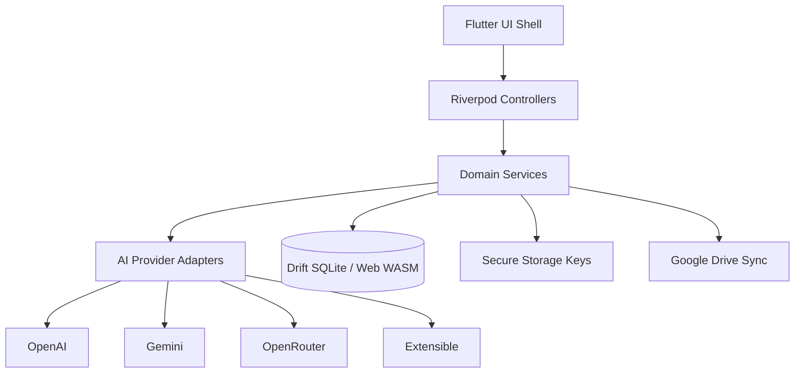
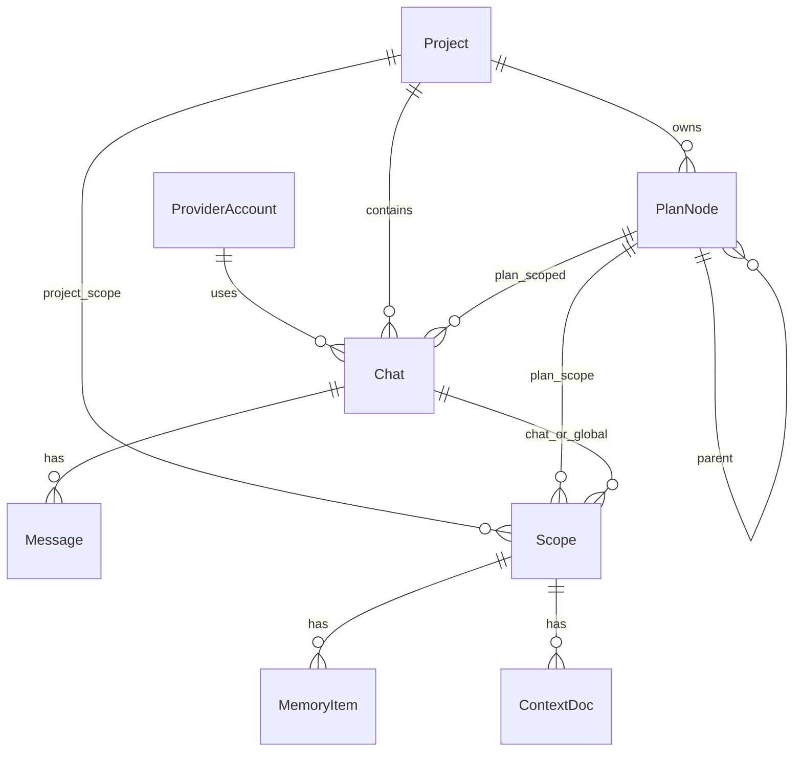

# DotDotDot AI — Full App Plan

## Product summary

A **local-first** Flutter app where users bring their own API keys (OpenAI, Gemini, OpenRouter, extensible), chat and generate media, organize work into **projects** and deeply nested **plans/courses**, attach **scoped memory + custom context**, and optionally back up/sync via **Google Drive**.

**Defaults locked**

- Platforms: Android, iOS, Windows, Web (scaffold all; iterate primarily on Windows/Web in this environment)
- Storage: on-device DB as source of truth; Drive is optional overlay
- Auth: no mandatory account — app works offline with local data; Google Sign-In only when enabling Drive
- Bootstrap: copy Flutter platform shells from [`project-finance`](C:\Users\kartik.juneja\Documents\GitHub\project-finance\apps\project-finance) into empty [`dotdotdot-AI`](C:\Users\kartik.juneja\Documents\dotdotdot-AI) (no admin / fragile `flutter create` assumptions)

## Architecture



### Layering (`lib/`)

```
lib/
  main.dart
  app/                 # MaterialApp, theme, go_router
  core/                # errors, result, ids, clocks, logging
  data/
    db/                # Drift schema + DAOs
    secure/            # API key vault
    sync/              # Drive sync engine
  domain/
    models/
    repositories/
    services/          # chat, media, plans, memory, context
  ai/
    catalog/           # model capability registry
    providers/         # OpenAI, Gemini, OpenRouter adapters
    routing/           # pick provider + model by capability
  features/
    shell/             # left nav: chats, projects, plans
    chat/
    media/
    projects/
    plans/
    settings/          # keys, providers, Drive
    context/           # custom context editor
  design_system/
```

### Core libraries (chosen for speed + cross-platform)

| Concern | Choice | Why |
|--------|--------|-----|
| State | `flutter_riverpod` + `riverpod_annotation` | Testable, scalable, no Auth0-style session-only pattern from finance app |
| Routing | `go_router` | Deep links for chat/project/plan |
| Local DB | `drift` (+ `sqlite3` / `drift_flutter`) | Relational nested plans, FTS-ready memory; web via WASM |
| Secure keys | `flutter_secure_storage` (web: encrypted local storage fallback) | Never store raw keys in Drift |
| HTTP | `dio` | Streaming chat SSE, retries, interceptors |
| Models | `freezed` + `json_serializable` | Immutable domain + sync payloads |
| Drive | `google_sign_in` + `googleapis` (`drive.v3`) | Optional connect; app-folder scope |
| Media pick | `file_picker`, `path_provider`, `uuid` | Attachments + local media cache |
| Lint | `flutter_lints` / `very_good_analysis` | Match finance rigor |

Do **not** put API keys in Dart defines or git. Keys live only in secure storage, referenced by `provider_id` in settings rows.

## Domain model (local)



**Entities**

- `ProviderAccount` — provider type, display name, key vault ref, enabled
- `ModelCapability` — catalog entry: `chat | image | video | audio | embedding`, modalities, streaming, notes
- `Chat` — title, projectId?, planNodeId?, modelId, created/updated
- `Message` — role, parts (text/image/audio/video refs), usage, status
- `Project` — name, description, default model, memory scope
- `PlanNode` — tree (`parentId`), title, body, progress `0..100`, status, order
- `MemoryItem` — scoped facts the model may recall (auto + manual)
- `ContextDoc` — user-supplied custom context (markdown/text/files metadata) at **global / project / plan / chat** scope
- `SyncMeta` — Drive file id, revision, last sync, conflict state

**Capability UX:** model picker filters and badges by capability so users clearly see what can chat vs generate image/video/audio.

## AI provider design

Single interface:

```dart
abstract class AiProvider {
  Future<List<ModelInfo>> listModels();
  Stream<ChatDelta> streamChat(ChatRequest req);
  Future<MediaResult> generateImage(ImageRequest req);
  Future<MediaResult> generateVideo(VideoRequest req); // when supported
  Future<MediaResult> generateAudio(AudioRequest req); // when supported
}
```

- **OpenAI / OpenRouter / Gemini** adapters implement what each API supports; unsupported methods throw typed `CapabilityUnsupported`.
- Static + refreshable **model catalog** (bundled JSON + optional live list merge) drives UI badges.
- OpenRouter is the fast path for “many models one key”; first-party OpenAI/Gemini stay first-class.
- Chat completion injects system prompt from merged scopes: **global → project → plan ancestors → chat** context + memory (token-budget trimmed).

## UI shell (ChatGPT / Gemini-like)

- Left sidebar: New chat, Chats list, Projects, Plans/Courses, Settings
- Main pane: conversation / plan editor / media canvas
- Responsive: permanent drawer on desktop/web; modal nav on mobile
- Project: create chat inside, move chat in/out
- Plans: nested tree, progress controls, “open plan chat” that can update the plan via structured tool/JSON patch (phase 5+)

## Google Drive sync (optional, local remains source of truth)

- Connect in Settings → Google account with **Drive App Data / restricted app folder** (avoid full Drive unless user opts in later)
- Sync package: encrypted export of Drift snapshot + media index (not raw API keys in Drive — keys stay device-only unless user explicitly enables “backup keys” toggle, default **off**)
- Engine: change log → push/pull → last-write-wins with conflict copy (`*_conflict`) for simultaneous edits
- Works when online; app fully usable offline without Drive

## Environment constraints

- No admin rights: prefer **copying** `android/`, `ios/`, `web/`, `windows/` (and macos if present) from project-finance, then rewrite `lib/` + `pubspec.yaml` for this app
- Avoid global Flutter upgrades; pin SDK in docs to whatever `flutter --version` returns on the machine
- `pub get` may need network; if blocked, document offline vendor approach
- Dart MCP currently broken in this environment — rely on CLI/`analyze` when Flutter is available

## Delivery structure (session-friendly)

- [`docs/ARCHITECTURE.md`](ARCHITECTURE.md) — this design, short
- [`docs/TASKS.md`](TASKS.md) — master checklist by phase
- [`docs/phases/`](phases/) — one file per phase with acceptance criteria

Each chat session: pick the next unchecked task, implement, mark done.

---

## Phases

### Phase 0 — Bootstrap & engineering baseline

- Copy Flutter multi-platform shell from project-finance into `dotdotdot-AI`
- New package name `dotdotdot_ai`, clean `lib/`, theme tokens, `go_router` stub, Riverpod root
- `analysis_options.yaml`, folder conventions, README (run targets per platform)
- **Done when:** app launches on at least Windows or Web with empty shell UI

### Phase 1 — Local data + secure keys

- Drift schema for providers, chats, messages, projects, plan nodes, memory, context, sync meta
- Secure storage vault for API keys
- Settings UI: add/remove provider keys (OpenAI, Gemini, OpenRouter)
- **Done when:** keys persist across restart; CRUD chats/projects in DB without AI calls

### Phase 2 — Chat + model catalog

- Provider adapters + streaming chat (start with OpenAI-compatible + OpenRouter; then Gemini)
- Bundled capability catalog + model picker badges (chat/image/video/audio)
- Sidebar chat list, new chat, message composer, streaming UI
- **Done when:** user can chat with a real key and see capability badges

### Phase 3 — Projects & chat organization

- Projects CRUD, assign/move chats, project default model
- Project-scoped memory + context docs
- **Done when:** move chat in/out of project; project context affects replies

### Phase 4 — Nested plans/courses + progress

- Plan tree UI (infinite nesting), progress 0–100, reorder
- Plan-scoped chats; plan memory/context inheritance up the ancestor chain
- Manual plan edit + progress updates
- **Done when:** multi-level course tree works with scoped chat

### Phase 5 — Plan-aware AI + custom context polish

- Structured “update plan” flow from plan chats (JSON patch / tool-style)
- Global / project / plan / chat context editor (text + file refs)
- Memory capture (manual pin; optional auto-extract later)
- **Done when:** chat can update nested plan nodes and progress safely

### Phase 6 — Media generation

- Image generation adapters + gallery in chat
- Audio where provider supports
- Video where provider supports (OpenRouter/Gemini/OpenAI video endpoints as available); clear unsupported UX
- Local media cache under app documents
- **Done when:** image path solid; video/audio graceful by capability

### Phase 7 — Google Drive optional sync

- Google Sign-In, connect/disconnect
- Encrypted backup package (exclude keys by default)
- Sync status UI, conflict handling, first-run restore
- **Done when:** two devices/sessions can restore chats/projects/plans via Drive without losing local-first offline use

### Phase 8 — Hardening

- Error surfaces, rate-limit handling, prompt budget trimming
- Tests: Drift repos, provider adapters (mocked HTTP), plan tree reducers, sync merge
- Accessibility + responsive polish; release checklists per platform

---

## Important engineering suggestions

1. **BYOK privacy:** never log keys; redact Authorization headers in debug
2. **Capability-first UI:** disable generate actions when model lacks modality — don’t rely on runtime failures
3. **Context merge with budget:** hard token/char budget; prefer nearer scopes (chat > plan > project > global)
4. **Idempotent sync:** every row has `uuid` + `updatedAt` + `deletedAt` (soft delete) for Drive merge
5. **Adapter isolation:** adding Anthropic/Mistral later = new adapter + catalog entries only
6. **Web caveats:** secure storage weaker on web; show security note; Drift WASM setup in Phase 0/1
7. **Video reality:** treat video as best-effort per provider; catalog marks `experimental`
8. **No backend required** for v1 — keeps this environment simple and matches local-first

## Implementation checklist

| Phase | Status | Focus |
|-------|--------|-------|
| 0 | pending | Bootstrap shell from project-finance; Riverpod/go_router |
| 1 | pending | Drift schema + secure API key vault + provider settings |
| 2 | pending | AI adapters, capability catalog, streaming chat |
| 3 | pending | Projects, move chats, project memory/context |
| 4 | pending | Nested plan/course tree, progress, plan-scoped chats |
| 5 | pending | Plan updates from chat + scoped custom context/memory |
| 6 | pending | Image/audio/video generation + local media cache |
| 7 | pending | Optional Google Drive sync + conflicts |
| 8 | pending | Tests, hardening, release checklists |

## First implementation session

1. Write `docs/ARCHITECTURE.md` + `docs/TASKS.md` + phase files
2. Bootstrap Flutter tree from project-finance
3. Empty shell + sidebar scaffold (Phase 0 start)
